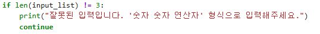
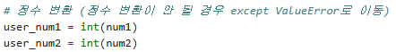
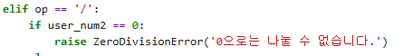

# AIFFEL Campus Online Code Peer Review Templete
- 코더 : 이다겸
- 리뷰어 : 정슬기


# PRT(Peer Review Template)
- [X]  **1. 주어진 문제를 해결하는 완성된 코드가 제출되었나요?**
    - user_input.split()을 통해 num1, num2, op를 한 번에 파싱하는 방식은 매우 효율적입니다.
    - len(input_list) != 3 조건을 통해 사용자가 덜 입력하거나 더 입력하는 경우를 완벽히 차단
    - 

- [X]  **2. 전체 코드에서 가장 핵심적이거나 가장 복잡하고 이해하기 어려운 부분에 작성된 
주석 또는 doc string을 보고 해당 코드가 잘 이해되었나요?**
    - 주석을 통해 각 단계별로 무엇을 하는지 명확히 설명하고 있습니다.
    - try-except와 if-else의 분기가 코드의 흐름을 방해하지 않고 직관적으로 작성되어 있습니다.
    - 
        
- [X]  **3. 에러가 난 부분을 디버깅하여 문제를 해결한 기록을 남겼거나
새로운 시도 또는 추가 실험을 수행해봤나요?**
    - ZeroDivisionError를 raise로 직접 발생시키고,
    - except ZeroDivisionError as e로 해당 에러 메시지를 print(e)로 받아 출력방식이 최고예요.
            - 
- [X]  **4. 회고를 잘 작성했나요?**
    - split() 함수를 사용하면 사용자의 복잡한 입력을 한 번에 처리할 수 있어 코드가 훨씬 간결해진다는 것을 배웠습니다.
    - 연산자가 추가될 때마다 if-elif를 늘려야 하는 구조입니다. 다음번엔 딕셔너리를 활용해 로직을 분리해보고 싶습니다.
    - 그렇지만 추가로 프로그래밍 해놓으신 부분에 딕셔너리활용을 이미 해보신것 같아요 ^^*
        
- [X]  **5. 코드가 간결하고 효율적인가요?**
    - 한눈에봐도 안정적으로 짜여진 코드가 인상적  이었습니다.
    - 


# 회고(참고 링크 및 코드 개선)
```
제가 보기에 다른 문제점이나 개선방법을  찾지못해, GPT의 도움으로 개선방법을 찾아왔습니다.
제가 찾지 못한걸  물으며 저도 공부하는 방법중 하나로 사용하고 있습니다.
***********************************
# 마지막 except 블록 뒤에 코드가 열려있을 수 있으니,전체 코드를 if __name__ == "__main__": 
  블록 안에 넣어주면 더 완성도 높은 코드가 됩니다.

  라고 알려주네요 :) 
```
