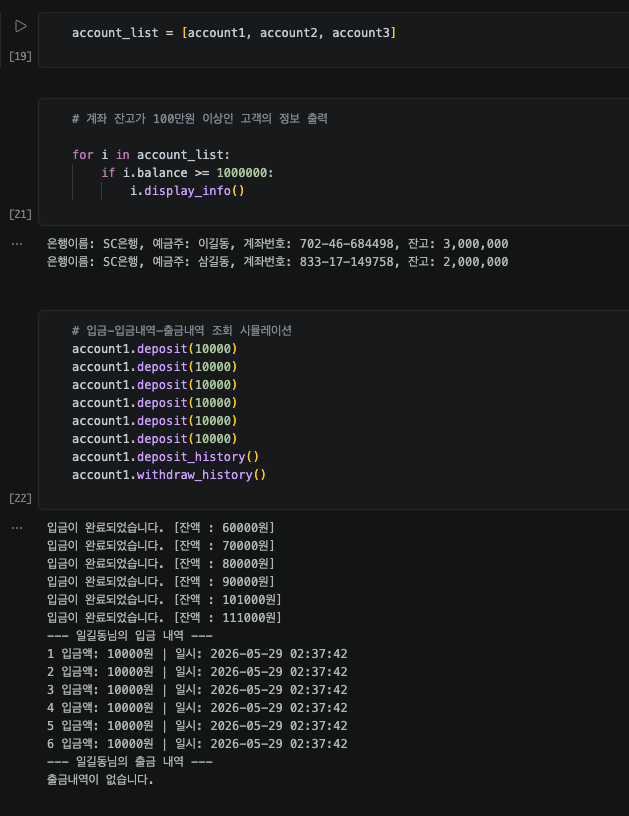
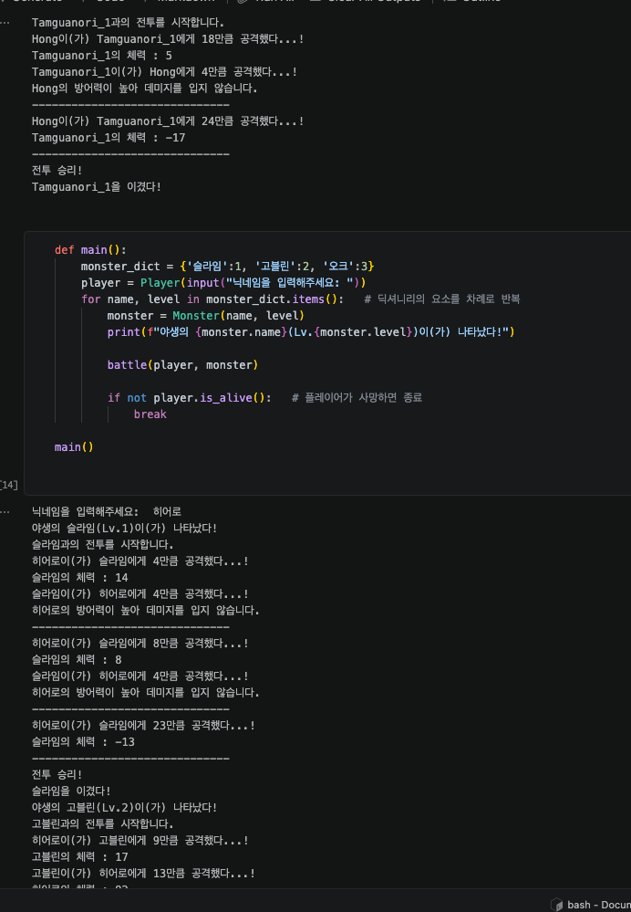
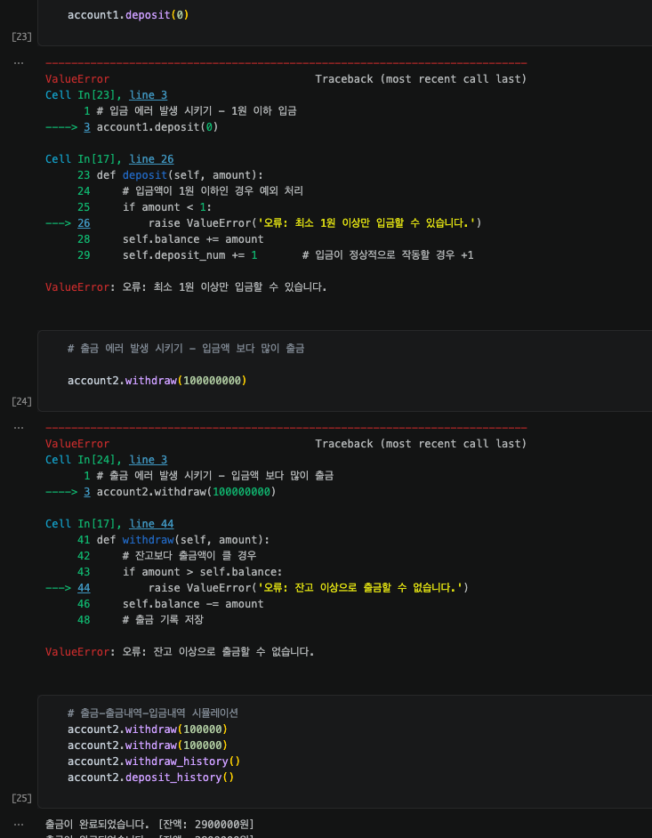
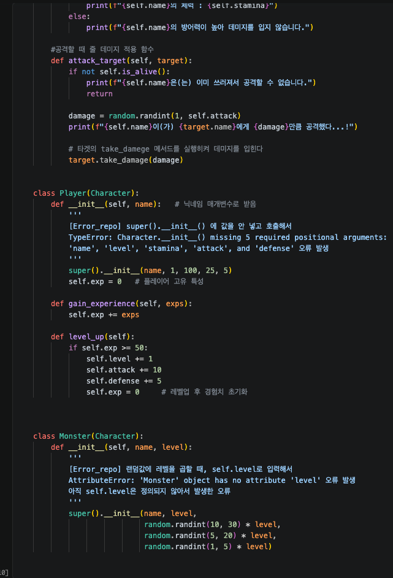

# AIFFEL Campus Online Code Peer Review Templete
- 코더 : 이다겸
- 리뷰어 : 김민욱


# PRT(Peer Review Template)
- [x]  **1. 주어진 문제를 해결하는 완성된 코드가 제출되었나요?**
    - 두 퀘스트 모두 요구사항을 모두 만족하는 코드가 제출되었습니다.
    - **퀘스트 1 (은행계좌)**: `Account` 클래스에 `name`, `balance`, `bank_name`(SC은행), 랜덤 `account` 번호, 클래스 속성 `account_num`까지 모두 구현되었고, `get_account_num`을 `@classmethod`로 정의한 점이 정확합니다(인스턴스 없이 호출 가능). 입금 5회마다 1% 이자 지급, 입출금 내역 기록, `display_info`, 잔고 100만원 이상 고객 필터링까지 모두 동작했습니다.  
    
    - **퀘스트 2 (RPG)**: 부모 `Character` 클래스와 자식 `Player`/`Monster` 상속 구조가 잘 짜여 있고, `battle()` 함수와 `main()` 시뮬레이션이 정상 실행되어 슬라임 → 고블린 → 오크 순서로 전투가 진행되는 출력까지 확인했습니다.  
    

- [x]  **2. 전체 코드에서 가장 핵심적이거나 가장 복잡하고 이해하기 어려운 부분에 작성된
주석 또는 doc string을 보고 해당 코드가 잘 이해되었나요?**
    - `Account.deposit` 메서드 안에 **이자 지급 로직**(`self.deposit_num % 5 == 0` 분기)이 핵심이라고 봤는데, "5번 입금할 때 마다 이자를 지급" 이라는 주석이 명확히 달려 있어 의도가 한눈에 들어옵니다.
    - `Player.__init__`과 `Monster.__init__`의 docstring(`[Error_repo]` 표시)이 특히 인상적이었습니다. `super().__init__()` 호출 시 발생했던 `TypeError`와 `AttributeError`를 코드 내부에 박제해 두어, 왜 이렇게 작성해야 하는지를 코드만 봐도 이해할 수 있게 만들어두셨네요.  
    

- [x]  **3. 에러가 난 부분을 디버깅하여 문제를 해결한 기록을 남겼거나
새로운 시도 또는 추가 실험을 수행해봤나요?**
    - `[Error_repo]` 형식으로 두 군데에 디버깅 흔적을 남기신 게 좋았습니다 — `Player.__init__`의 부모 생성자 인자 누락 케이스, `Monster.__init__`의 `self.level` 참조 시점 오류 두 가지 모두 원인과 해결을 명확히 적어두셨어요.
    - 추가로 노트북 안에서 직접 `account1.deposit(0)`과 `account2.withdraw(100000000)`을 호출해 `ValueError`가 실제로 발생하는 것을 셀 출력으로 보여준 것도 좋은 검증 방식이었습니다.  
    

- [x]  **4. 회고를 잘 작성했나요?**
    - 마지막 NOTE 셀에 "상속받은 자식클래스에서 생성자함수를 사용할 때 오류가 발생 … 간단한 실수였지만 치명적이었다"는 구체적인 배움이 적혀 있어, 단순 감상이 아니라 무엇을 배웠는지가 명확합니다.

- [x]  **5. 코드가 간결하고 효율적인가요?**
    - 메서드/클래스 네이밍이 snake_case / PascalCase 규칙을 잘 따르고 있습니다. 메서드 마다 주석이 있고 간결한 로직으로 구현되어있습니다.  
    - display_info에서 f"{self.balance:,}"로 천 단위 콤마를 넣은 부분이 깔끔했습니다.


# 리뷰어 회고
```
# 리뷰어의 회고
전반적으로 클래스 설계와 상속 구조가 매우 잘 잡혀 있고, 에러를 코드 내부에 ''' 주석 '''으로 기록한 `[Error_repo]` 방식이 특히 인상적이었습니다.  
요구사항을 빠짐없이 구현했을 뿐 아니라 Error를 실제로 발생시켜 검증한 셀까지 두신 점이 꼼꼼했습니다. 잘 배웠습니다.

# 참고 링크  
- @classmethod에 대해 저도 검색해봤던게 있어서 참고자료를 추가해봅니다.
- @classmethod : https://docs.python.org/3/library/functions.html#classmethod  
- @staticmethod: https://docs.python.org/3/library/functions.html#staticmethod
```
