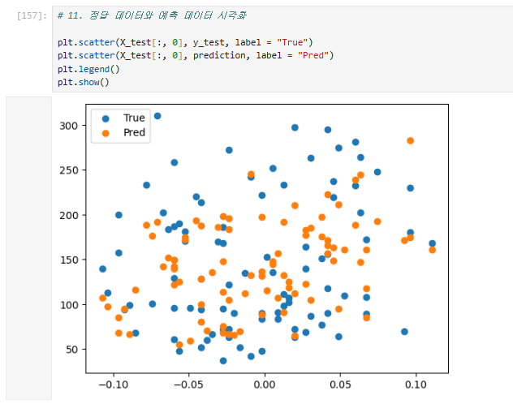
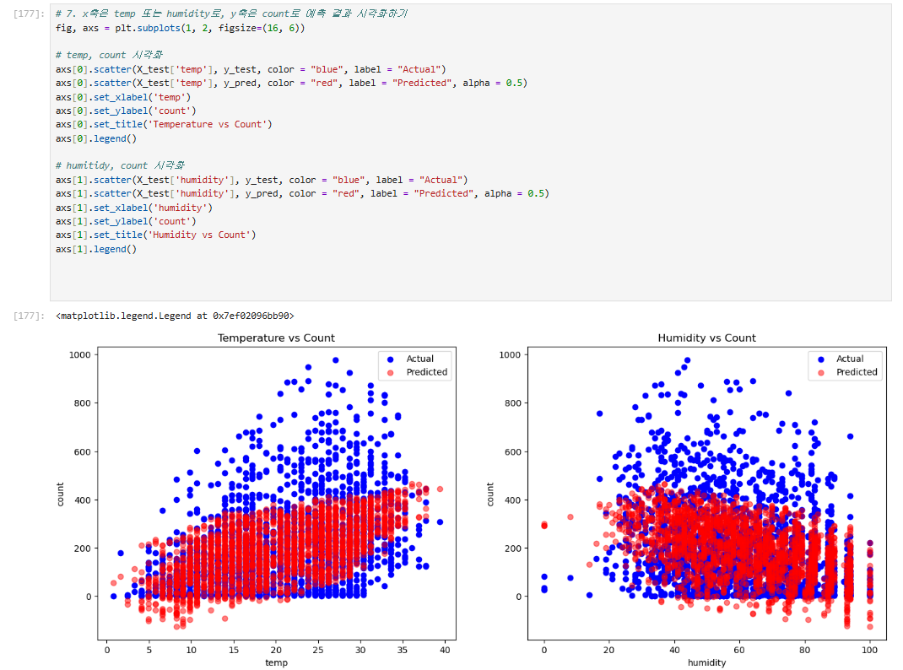
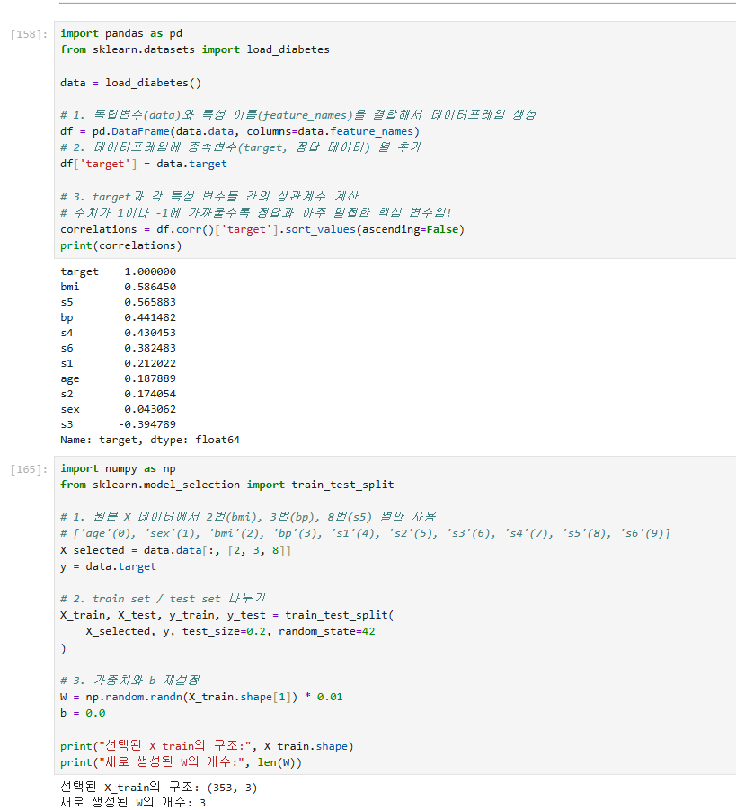
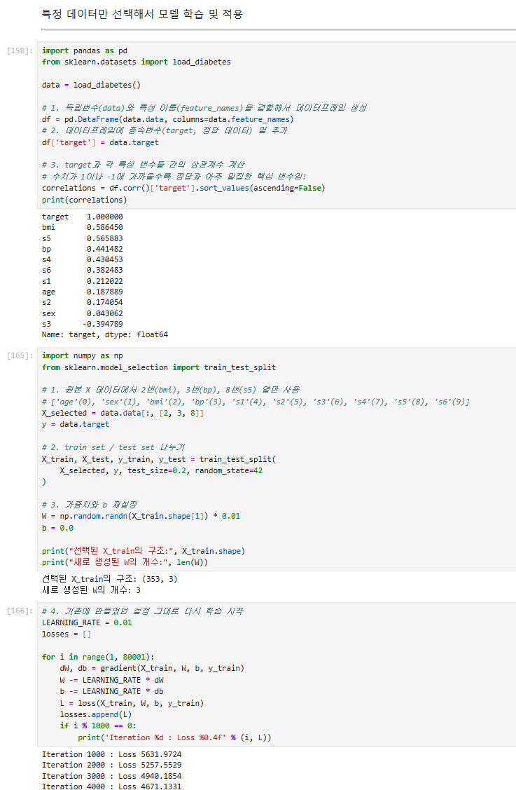
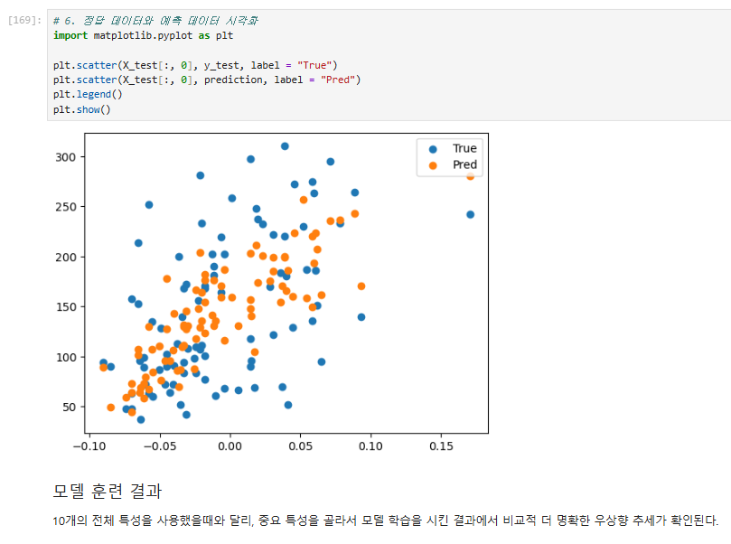
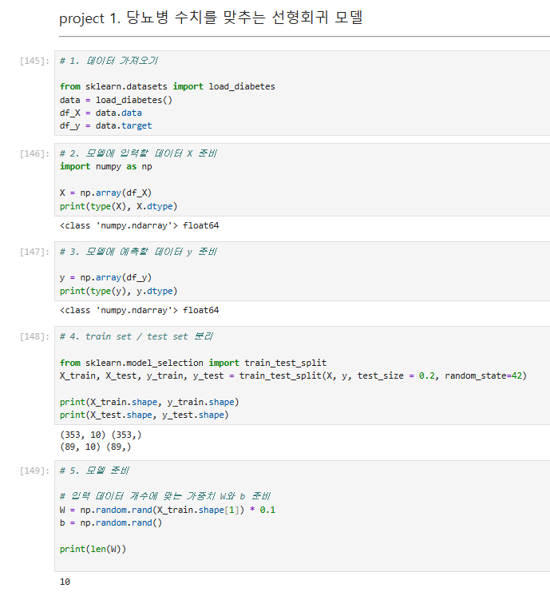
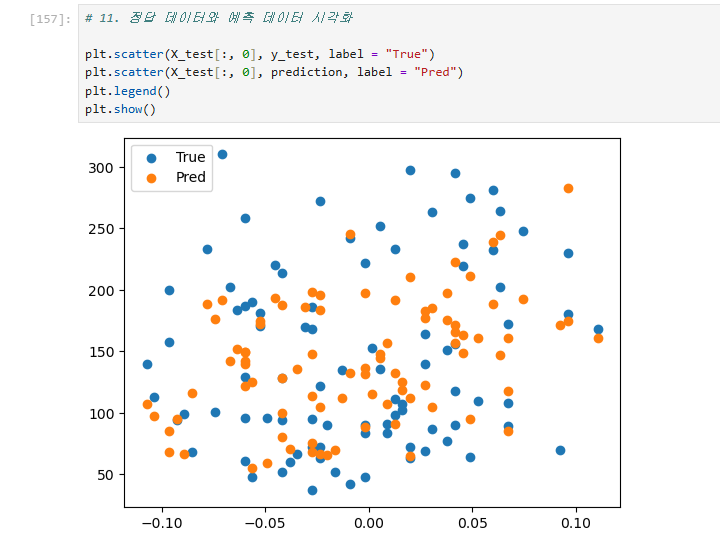

# AIFFEL Campus Online Code Peer Review Templete
- 코더 : 이다겸
- 리뷰어 : 김수경


# PRT(Peer Review Template)
- [x]  **1. 주어진 문제를 해결하는 완성된 코드가 제출되었나요?**  

   

두 과제 모두 잘 작성되었습니다.  

    
- [x]  **2. 전체 코드에서 가장 핵심적이거나 가장 복잡하고 이해하기 어려운 부분에 작성된 
주석 또는 doc string을 보고 해당 코드가 잘 이해되었나요?**


중요한 부분에 대해 주석처리를 통해 이해할 수 있게 작성되었습니다.  

        
- [x]  **3. 에러가 난 부분을 디버깅하여 문제를 해결한 기록을 남겼거나
새로운 시도 또는 추가 실험을 수행해봤나요?**


추가적인 학습에 대해 주석처리와 함께 잘 정리되어있습니다.
        
- [ ]  **4. 회고를 잘 작성했나요?**


과제와는 다른 부분으로 모델을 학습시켜 달라지 부분에 대해 작성되어있습니다.  

        
- [x]  **5. 코드가 간결하고 효율적인가요?**

  
학습시간에 배운 부분으로 잘 작성된 코드입니다.

# 회고(참고 링크 및 코드 개선)
```
# 리뷰어의 회고를 작성합니다.
# 코드 리뷰 시 참고한 링크가 있다면 링크와 간략한 설명을 첨부합니다.
# 코드 리뷰를 통해 개선한 코드가 있다면 코드와 간략한 설명을 첨부합니다.
```
 
그래프를 출력하면서 놓쳤던 부분을 다겸님 코드를 보고 배울 수 있었습니다.  
