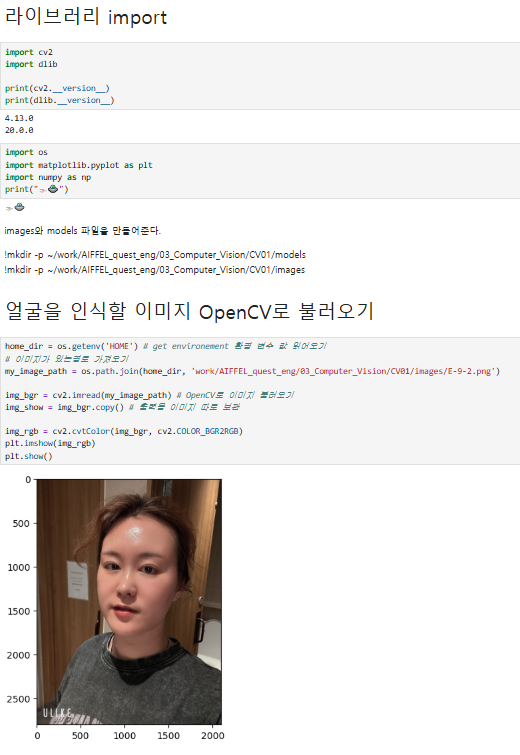
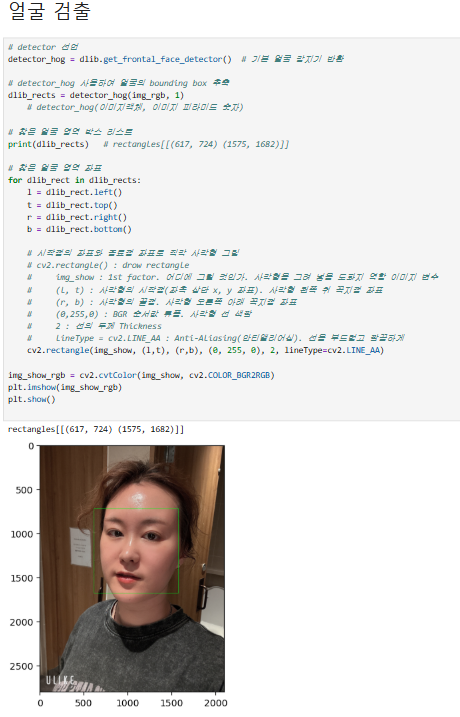
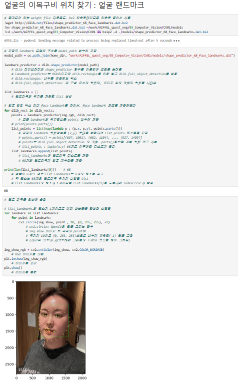
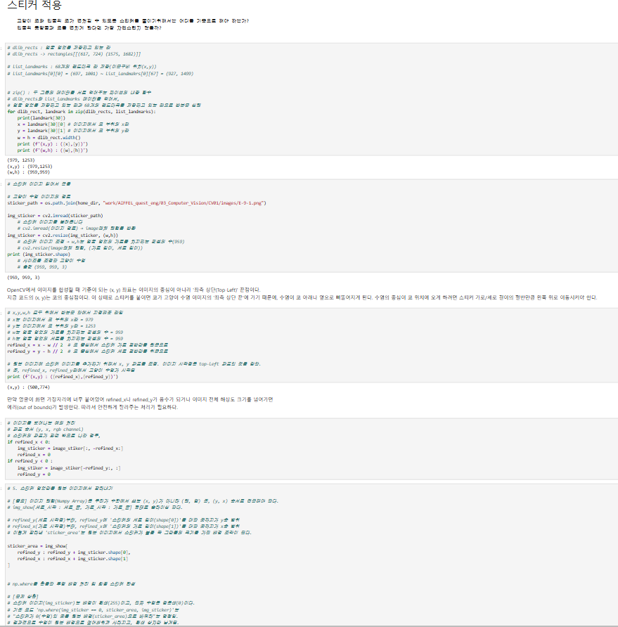
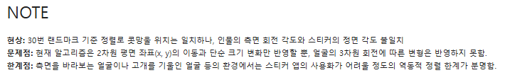
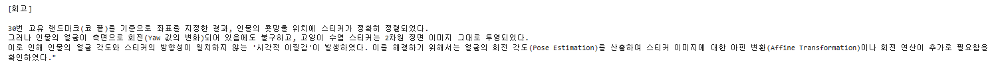
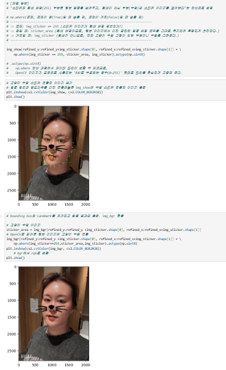

# AIFFEL Campus Online Code Peer Review Templete
- 코더 : 이다겸
- 리뷰어 : 조현겸

# PRT(Peer Review Template)
- [x]  **1. 주어진 문제를 해결하는 완성된 코드가 제출되었나요?**

   

:네 cv로 이미지를 불러오고 얼굴에 cv인식도 잘 되었어요

- [x]  **2. 전체 코드에서 가장 핵심적이거나 가장 복잡하고 이해하기 어려운 부분에 작성된 
주석 또는 doc string을 보고 해당 코드가 잘 이해되었나요?**

:중간중간에 해당 코드의 제목과 설명이 적혀있어서 어떤 코드가 어떤 역활을 하는지 알기 쉬웠습니다
        
- [x]  **3. 에러가 난 부분을 디버깅하여 문제를 해결한 기록을 남겼거나
새로운 시도 또는 추가 실험을 수행해봤나요?**

:문제점과 한게점에 대해서 기록을 하였습니다
        
- [x]  **4. 회고를 잘 작성했나요?**

:회고를 적고 얼굴각도에 따라 스티커의 각도에는 영향이 미치지 않는 점을 반결하였습니다

- [x]  **5. 코드가 간결하고 효율적인가요?**

 

 :주어진 문제를 해결하는데 필요한 코드를 적절히 사용해서 간결하고 효율적이게 짰습니다

# 회고(참고 링크 및 코드 개선)

:얼굴 각도가 예를 들어 20도 돌려져 있을때 스티커의 각도는 수평을 유지하고 있어서 이런점이 약간의 조정이 필요하다는 사실을 알게 되었어요