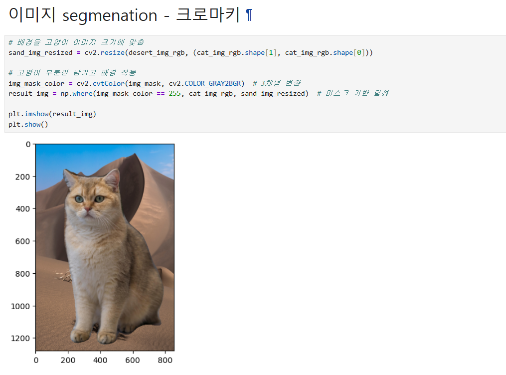
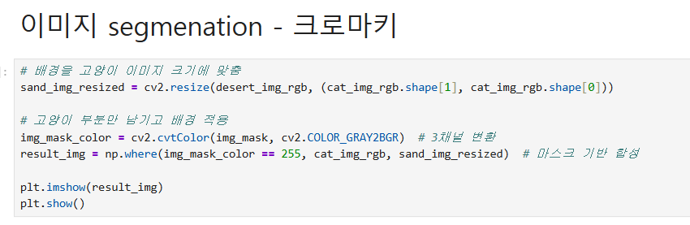
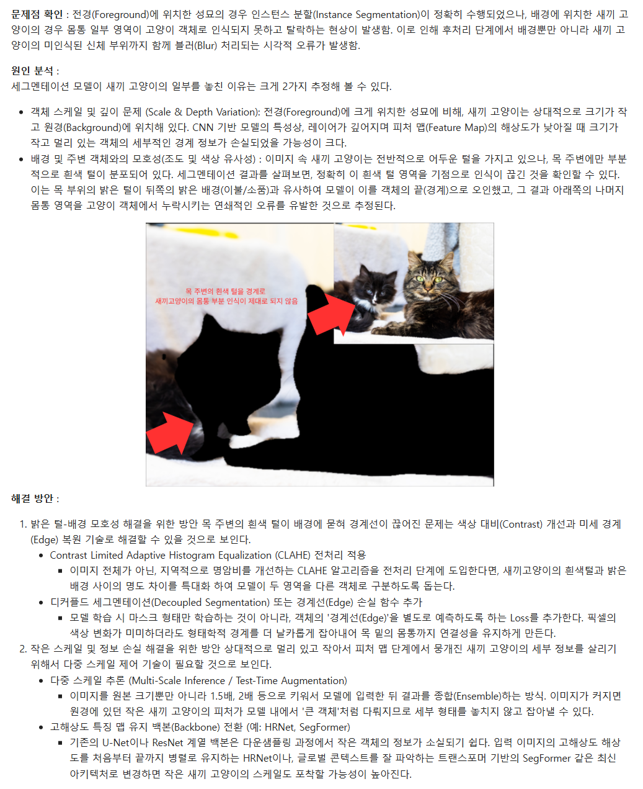
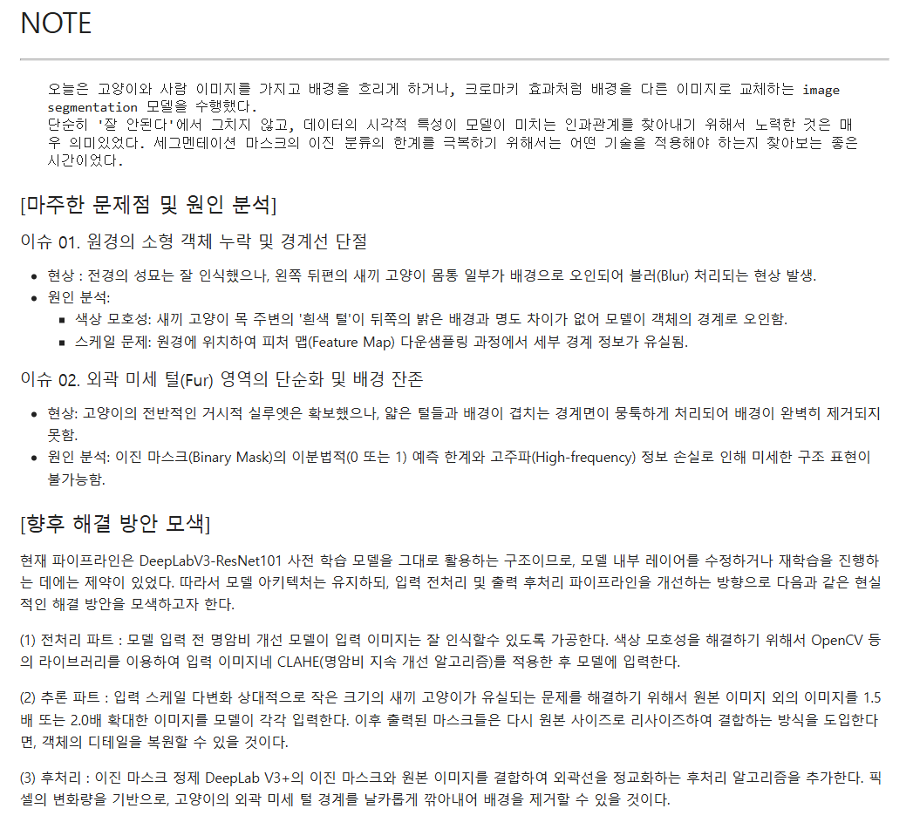
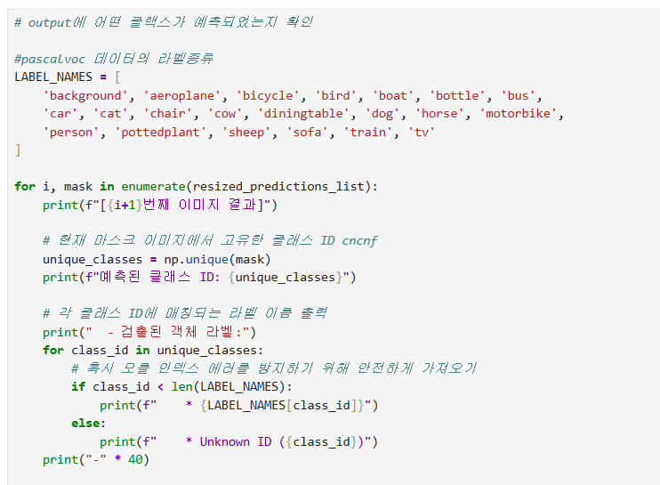

# AIFFEL Campus Online Code Peer Review Templete
- 코더 : 이다겸
- 리뷰어 : 임성배


# PRT(Peer Review Template)
- [X]  **1. 주어진 문제를 해결하는 완성된 코드가 제출되었나요?**
    - 문제 해결 코드와 그 결과물이 제출된 것을 확인하였습니다  
            
    
- [X]  **2. 전체 코드에서 가장 핵심적이거나 가장 복잡하고 이해하기 어려운 부분에 작성된 
주석 또는 doc string을 보고 해당 코드가 잘 이해되었나요?**
    - 배경 합성에 대해 주석과 간결한 코딩을 통해 이해하기 쉽도록 코딩하였습니다.  
             
        
- [X]  **3. 에러가 난 부분을 디버깅하여 문제를 해결한 기록을 남겼거나
새로운 시도 또는 추가 실험을 수행해봤나요?**
    - 문제점을 시각화하여 정확히 확인하였고, 원인 분석 및 해결 방안에 대한 다양한 방법들을 제시하였습니다.  
    - 다양한 방법으로 퀘스트에서 요청한 해결방안에 대해 정리하였습니다.  
             
        
- [X]  **4. 회고를 잘 작성했나요?**
    - 회고가 일목요연하게 잘 작성되어 있었고, 퀘스트 진행 복기 및 향후 스탭 등을 잘 작성해주셨습니다. 
             
        
- [X]  **5. 코드가 간결하고 효율적인가요?**
    - 불필요한 부분 없이 간결하고 깔끔하게 잘 코딩되어 있었습니다.  
             


# 회고(참고 링크 및 코드 개선)
```
# 리뷰어의 회고를 작성합니다.
# 코드 리뷰 시 참고한 링크가 있다면 링크와 간략한 설명을 첨부합니다.
# 코드 리뷰를 통해 개선한 코드가 있다면 코드와 간략한 설명을 첨부합니다.
```  

이번 퀘스트는 인물모드를 진행하며 발생한 다양한 문제점들을 발견하고, 이를 해결하기 위한 현실적이고 구체적인 추론 방향을 정리하는 내용이었습니다.  
코딩 내용과 주석, 회고에서 이런 부분들이 잘 정리되어 있었고, 향후에는 어떤 스탭으로 진행해야 할지 스탭 별로 정리되어 있어서 같은 퀘스트를 진행한 입장에서 많은 참고가 되었습니다.  

수고하셨습니다. 
